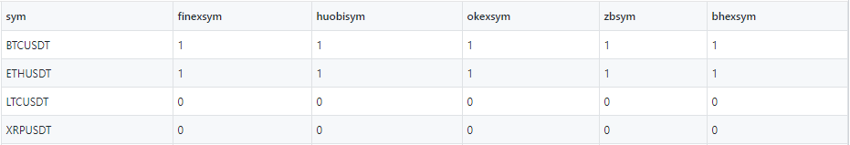
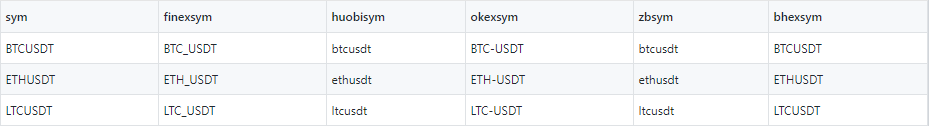

# TorQ-Crpyto Configuration

### Frequency and Limit 

The frequency at which each feed queries their respective crypto currency 
exchanges is fully configurable along with the request limit. 
We have availed of the default settings file appconfig/settings/default.q 
to set a frequency of 30 seconds and a limit of 10 across all exchanges. 

    \d .crypto

    deffreq : 0D00:00:30.000
    deflimit: "10"

In the individual settings files for each exchanges we have set the frequency 
and limit to the default values. However these can be changed on a per exchanges 
basis. In the example below from appconfig/settings/huobifeed.q the huboi feed 
will query its respective api every 30 seconds retrieving a maximum for 10 quotes 
for its subscribed symbols. 

    \d .huobi

    limit: .crypto.deflimit
    freq:.crypto.deffreq

### Symbol Configuration  

Symbol subscription is specified on a per exchange in appconfig/symconfig.csv. 
In this file we have included 15 symbols which are common across the 5 exchanges, 
but by default only Bitcoin and Ethereum are subscribed to.

This symbol configuration has a dependency on appconfig/symap.csv which maps tickers 
across exchanges to one common identifier. Therefore if a new crypto currency is to 
be added both of these files must be taken into consideration. 

