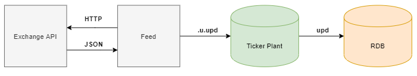

# Data Capture

### Feed Handlers

The feed handler processes collect real time crypto currency data though 
RESTful APIs. We have added 5 feeds which collect data from the following 
exchanges:

-    OKEX (okex) 
-    DigiFinex (finex) 
-    Huobi (huobi) 
-    ZB (zb) 
-    Blue Helix (bhex) 

Each feed collects level 2 order book data for its subscribed symbols at a set 
frequency and limited which is discussed here. After converting the JSON response 
to a kdb table the following standardisation occurs before the data is sent to the 
ticker plant:

-    Conversion of times to kdb timestamps 
-    Quotes arranged in order of best to worst 
-    Duplicated data will not be sent (i.e quotes that have not changed from last publish)

This diagram summarises the data capture:

### Tables

Each feed pusblishes data to three tables in the RDB; exchange, exchange_top
and a table specific to its own exchange. The exchange table contain a superset
of L2 data collect from all exchange with exhange_top containg only top of book 
data. It is these exhanges table which are used in the inbuilt functions to compare
quotes across exchanges and over time. 

    meta exchange
    c           | t f a
    ------------| -----
    time        | p
    sym         | s   g
    exchangeTime| p
    exchange    | s
    bid         | F
    bidSize     | F
    ask         | F
    askSize     | F

    meta exchange_top
    c           | t f a
    ------------| -----
    time        | p
    sym         | s   g
    exchangeTime| p
    exchange    | s
    bid         | f
    bidSize     | f
    ask         | f
    askSize     | f
