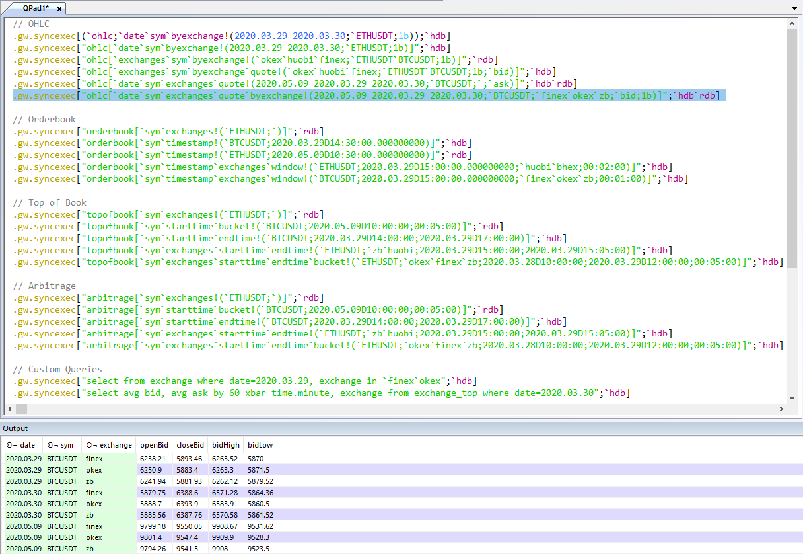

### Gateway

We recommend executing the previously discussed database functions through the gateway processes
to avail of query routing and load balancing. Full gateway functionality is discussed [here](http://aquaqanalytics.github.io/TorQ/Processes/#gateway).

To use, connect to the gateway from q process, qcon or from an IDE. An example is shown below 
running from an IDE.

Example queries are listed below.

    // OHLC 
    .gw.syncexec[(`ohlc;`date`sym`byexchange!(2020.03.29 2020.03.30;`ETHUSDT;1b));`hdb]
    .gw.syncexec["ohlc[`date`sym`byexchange!(2020.03.29 2020.03.30;`ETHUSDT;1b)]";`hdb]
    .gw.syncexec["ohlc[`exchanges`sym`byexchange!(`okex`huobi`finex;`ETHUSDT`BTCUSDT;1b)]";`rdb]
    .gw.syncexec["ohlc[`exchanges`sym`byexchange`quote!(`okex`huobi`finex;`ETHUSDT`BTCUSDT;1b;`bid)]";`hdb]
    .gw.syncexec["ohlc[`date`sym`exchanges`quote!(2020.05.09 2020.03.29 2020.03.30;`BTCUSDT;`;`ask)]";`hdb`rdb]
    .gw.syncexec["ohlc[`date`sym`exchanges`quote`byexchange!(2020.05.09 2020.03.29 2020.03.30;`BTCUSDT;`finex`okex`zb;`bid;1b)]";`hdb`rdb]
    
    // Orderbook
    .gw.syncexec["orderbook[`sym`exchanges!(`ETHUSDT;`)]";`rdb]
    .gw.syncexec["orderbook[`sym`timestamp!(`BTCUSDT;2020.03.29D14:30:00.000000000)]";`hdb]
    .gw.syncexec["orderbook[`sym`timestamp!(`ETHUSDT;2020.05.09D10:30:00.000000000)]";`rdb]
    .gw.syncexec["orderbook[`sym`timestamp`exchanges`window!(`ETHUSDT;2020.03.29D15:00:00.000000000;`huobi`bhex;00:02:00)]";`hdb]
    .gw.syncexec["orderbook[`sym`timestamp`exchanges`window!(`BTCUSDT;2020.03.29D15:00:00.000000000;`finex`okex`zb;00:01:00)]";`hdb]
    
    // Top of Book
    .gw.syncexec["topofbook[`sym`exchanges!(`ETHUSDT;`)]";`rdb]
    .gw.syncexec["topofbook[`sym`starttime`bucket!(`BTCUSDT;2020.05.09D10:00:00;00:05:00)]";`rdb]
    .gw.syncexec["topofbook[`sym`starttime`endtime!(`BTCUSDT;2020.03.29D14:00:00;2020.03.29D17:00:00)]";`hdb]
    .gw.syncexec["topofbook[`sym`exchanges`starttime`endtime!(`ETHUSDT;`zb`huobi;2020.03.29D15:00:00;2020.03.29D15:05:00)]";`hdb]
    .gw.syncexec["topofbook[`sym`exchanges`starttime`endtime`bucket!(`ETHUSDT;`okex`finex`zb;2020.03.28D10:00:00;2020.03.29D12:00:00;00:05:00)]";`hdb]

    // Arbitrage
    .gw.syncexec["arbitrage[`sym`exchanges!(`ETHUSDT;`)]";`rdb]
    .gw.syncexec["arbitrage[`sym`starttime`bucket!(`BTCUSDT;2020.05.09D10:00:00;00:05:00)]";`rdb]
    .gw.syncexec["arbitrage[`sym`starttime`endtime!(`BTCUSDT;2020.03.29D14:00:00;2020.03.29D17:00:00)]";`hdb]
    .gw.syncexec["arbitrage[`sym`exchanges`starttime`endtime!(`ETHUSDT;`zb`huobi;2020.03.29D15:00:00;2020.03.29D15:05:00)]";`hdb]
    .gw.syncexec["arbitrage[`sym`exchanges`starttime`endtime`bucket!(`ETHUSDT;`okex`finex`zb;2020.03.28D10:00:00;2020.03.29D12:00:00;00:05:00)]";`hdb]

    // Custom Queries
    .gw.syncexec["select from exchange where date=2020.03.29, exchange in `finex`okex";`hdb]
    .gw.syncexec["select avg bid, avg ask by 60 xbar time.minute, exchange from exchange_top where date=2020.03.30";`hdb]

##### Additional Information:

It is important to note that using syncexec to execute these inbuilt functions across the RDB
and HDB simultaneously may not always produce logical results. This is because syncexec runs the
function independently on each processes and will raze the results.

